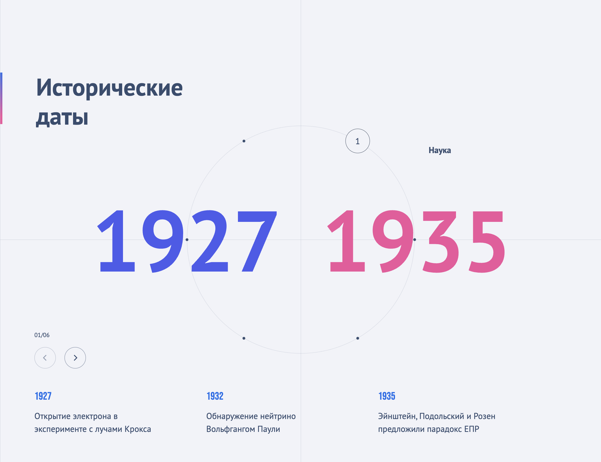

<h1 align='center'> Animated Circle </h1>




## Запуск проекта 
1) Установить зависимости

```bash
npm install
```
2) Запустить проект в режиме разработки на [http://localhost:3000](http://localhost:3000)
```bash
npm run dev
```

## Требования

- Необходимо использовать Typescript
- Стилизация с использованием SASS/SCSS
- Для работы со слайдерами необходимо использовать библиотеку Swiper
- Для реализации js-анимаций можно использовать библиотеку gsap


## Реализована верстка и логика согласно задаче

- Блок содержит информацию о временных отрезках, в каждом из которых существует несколько событий.
- При переключении временных отрезков изменяются соответствующие числа и под ними показывается новый слайдер, который содержит подробную информацию по ключевым событиям на активном временном отрезке.
- Все интерактивные точки на окружности располагаются на одинаковом расстоянии друг от друга
- Весь блок стоит сделать независимым от другой логики на странице. 


